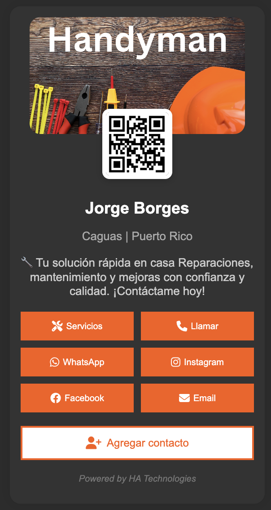

# BusinessCardPage

Página de tarjeta de presentación creadas con HTML, CSS y JavaScript para marca personal por HA Technologies.

## 📋 Descripción

Una tarjeta de presentación digital moderna y responsiva que permite a los profesionales mostrar su información de contacto y servicios de manera atractiva. Ideal para técnicos, contratistas, y profesionales de servicios.

## 📸 Vista Previa



## ✨ Características Incluidas

### 🎨 Diseño Visual
- **Banner personalizable**: Imagen de fondo que representa tu negocio
- **Foto de perfil**: Imagen circular superpuesta sobre el banner
- **Diseño responsivo**: Se adapta a dispositivos móviles y desktop
- **Iconos Font Awesome**: Iconografía profesional para cada botón

### 👤 Información Personal
- **Nombre completo**: Título principal de la tarjeta
- **Ubicación**: Ciudad y país/estado
- **Descripción de servicios**: Breve presentación del negocio

### 📞 Botones de Contacto
- **Botón de Servicios**: Muestra lista detallada de servicios disponibles
- **Llamar**: Enlace directo para realizar llamadas telefónicas
- **WhatsApp**: Acceso directo al chat de WhatsApp
- **Instagram**: Enlace al perfil de Instagram
- **Facebook**: Enlace al perfil de Facebook
- **Email**: Enlace para enviar correos electrónicos
- **Agregar Contacto**: Función para descargar información de contacto (vCard)

### 🔧 Servicios Predefinidos (Ejemplo)
- Gympsum Board
- Cristalería General
- Puertas y Ventanas
- Cortinas de Interior
- Toldos Retractables
- Cortinas de Lona
- Techos en Galvalum
- Ebanistería
- Tormenteras
- Electricidad
- Plomería
- Cámaras de seguridad
- Alarmas

## 🛠️ Tecnologías Utilizadas

- **HTML5**: Estructura semántica del documento
- **CSS3**: Estilos y diseño responsivo
- **JavaScript**: Funcionalidades interactivas
- **Font Awesome 6.4.0**: Librería de iconos

## 📁 Estructura del Proyecto

```
BusinessCardPage/
├── BusinessCardPage.html    # Estructura principal
├── BusinessCardPage.css     # Estilos y diseño
├── BusinessCardPage.js      # Funcionalidades JavaScript
├── README.md               # Documentación
└── images/
    ├── Banner.png          # Imagen de fondo
    └── Profile.jpg         # Foto de perfil
```

## 🚀 Personalización

Para adaptar la tarjeta a tu negocio, edita los siguientes elementos en `BusinessCardPage.html`:

1. **Información personal**: Nombre, ubicación y descripción
2. **Enlaces de contacto**: Números de teléfono, redes sociales y email
3. **Imágenes**: Reemplaza las imágenes en la carpeta `images/`
4. **Servicios**: Modifica la lista en `BusinessCardPage.js`

## 🌐 Créditos

Desarrollado por [HA Technologies](https://ha-technologies-pr.vercel.app)